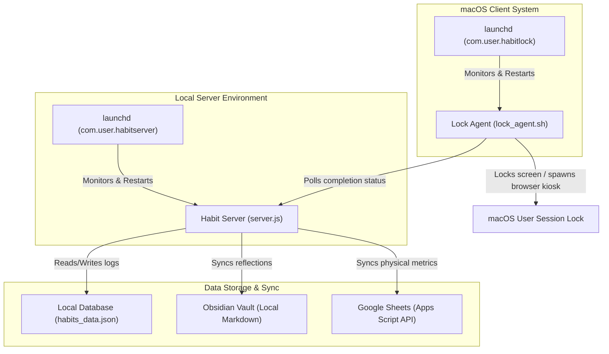

# 🛡️ Habit Armour

**Habit Armour** is a self-hosted macOS habit enforcement and device locking system. It secures your productivity by restricting Mac usage during morning and night logging windows until all your tracking and journaling goals are completed.

## 🧠 Origin & Motivation

Habit Armour was born out of a personal need to ensure strict adherence to tracking health and fitness metrics. When relying on willpower alone, it's easy to slip up and forget to log daily weights, sleep quality, caloric intake, or reflections. By binding Mac device access directly to completion of these daily tracking logs, Habit Armour introduces hardware-level accountability to protect health routines and enforce self-discipline.

---

## 🚀 Key Features

*   **🔒 Hardware Lock Enforcement**: Locks the screen and isolates the browser to a local kiosk window if required logs are not complete.
*   **📊 Bio-Analytics Dashboard**: Glassmorphic SaaS-style dashboard featuring curved bezier trend lines, glow filters, shaded goal targets, and rich hover tooltips.
*   **✏️ Historical Log Editing & Catch-up**: Directly modify historical logs or fill in missed past dates from the log history interface.
*   **⚙️ Custom Goal Targets**: Configure personal targets for Weight, steps, calories, and protein in the Settings panel.
*   **📝 Obsidian & Google Docs Integration**: Syncs journal reflections automatically to a local Obsidian vault (as markdown) and/or a Google Doc.
*   **📈 Google Sheets Integration**: Syncs physical stats, sleep quality, and macro intake directly to your Google Sheets tracker.
*   **💪 Hevy API & Gemini Gym Analysis**: Fetches your workout logs from Hevy App and uses Google Gemini AI to analyze your progressive overload and consistency.

---

## 🛠️ System Architecture



### 🔒 Enforcement via launchd
To guarantee accountability and prevent bypassing tracking routines, Habit Armor relies on macOS **`launchd`** system daemons:
- **`com.user.habitlock.plist`**: Manages the lock agent `lock_agent.sh`. By configuring the plist with `<key>KeepAlive</key><true/>`, macOS continuously ensures the lock agent runs in the background. If the user tries to manually force-quit or kill the process, `launchd` immediately respawns it within milliseconds, maintaining lock state integrity.
- **`com.user.habitserver.plist`**: Manages the API server `server.js` with `KeepAlive` enabled. If the backend fails or crashes due to network/system errors, it is instantly restarted, ensuring availability for status checking and submission.

---

## 📦 Setup & Installation

### 1. Prerequisites
Ensure you have **Node.js** installed on your macOS machine. You can verify this by running:
```bash
node -v
```

### 2. Configure Environment Variables
Copy the template environment file and customize it:
```bash
cp .env.example .env
```
Open `.env` and fill in your details:
*   **API Keys**: Add your `HEVY_API_KEY` and `GEMINI_API_KEY`.
*   **Obsidian Vault**: Provide the path to your Vault (`OBSIDIAN_VAULT_PATH`) and journal directory.
*   **Google Sheets / Docs**: Configure sheet sync options (see [GOOGLE_SHEET_SETUP.md](GOOGLE_SHEET_SETUP.md) for how to set up the spreadsheet backend script).

### 📊 Google Sheets Template & Sync Setup
Using Google Sheets as your primary storage is a lightweight, zero-maintenance replacement for hosting and managing a traditional SQL or NoSQL database. By treating Google Sheets as a database, you get a free, highly visual spreadsheet database that you can view and edit from any device out of the box, with Google Apps Script acting as your webhook API receiver.

Since the Google Apps Script sync uses coordinate-based grid mapping (targeting specific cells on a weekly grid layout), you **must** use the official sheet template for the integration to function correctly. 

#### Step-by-Step Setup:
1.  **Copy the Template**: Open the [Google Sheets Tracker Template](https://docs.google.com/spreadsheets/d/1ANTtB9WRy_vauvE6R8jx2cTXvdKTJA2NEUgJ2L7kfCA/edit?usp=sharing) and click **File** -> **Make a copy** to save it to your own Google Drive.
2.  **Open Apps Script**: In your new spreadsheet, go to **Extensions** -> **Apps Script** in the top menu.
3.  **Paste Endpoint Code**: Delete any default code in the editor, and copy-paste the complete Apps Script code provided in [GOOGLE_SHEET_SETUP.md](GOOGLE_SHEET_SETUP.md).
4.  **Deploy as Web App**:
    *   Click the blue **Deploy** button at the top right -> **New deployment**.
    *   Select **Web app** as the deployment type (click the gear icon next to "Select type" if it isn't listed).
    *   Configure:
        *   *Execute as*: **Me (your Google account)**
        *   *Who has access*: **Anyone**
    *   Click **Deploy** and authorize the script permissions.
5.  **Add to Environment**: Copy the generated **Web App URL**, open your `.env` file, and paste it:
    ```env
    GOOGLE_SHEETS_ENABLED=true
    GOOGLE_SHEETS_URL=https://script.google.com/macros/s/.../exec
    ```
    *(If using Google Docs for journaling as well, paste your Google Document ID or URL as `GOOGLE_DOC_ID` in your `.env` file)*

### 3. Install and Load Background Agents
Run the included installer script:
```bash
./install.sh
```
This script will:
1. Validate Node.js is present.
2. Install server dependencies.
3. Build the client frontend dashboard assets.
4. Set up the launchd background agents (`com.user.habitserver` and `com.user.habitlock`).
5. Copy the lock agent to your home directory (`~/.habitlock`).
6. Launch background services immediately.

The web interface will now be accessible at `http://localhost:3000` (or your custom port configured in `.env`).

---

## 🛑 Uninstallation

If you wish to stop and clean up the background daemons and files from your system, simply run:
```bash
./uninstall.sh
```

---

## 🖥️ Local Development

If you want to run the project in development mode with hot-reloading:

1.  **Start Server Backend**:
    ```bash
    npm install
    npm run dev
    ```
2.  **Start Client Frontend**:
    ```bash
    cd client
    npm install
    npm run dev
    ```

---

## 📄 License
This project is open-source and available under the MIT License.

---

*Built by Gemini, prompted by Rakshit.*
